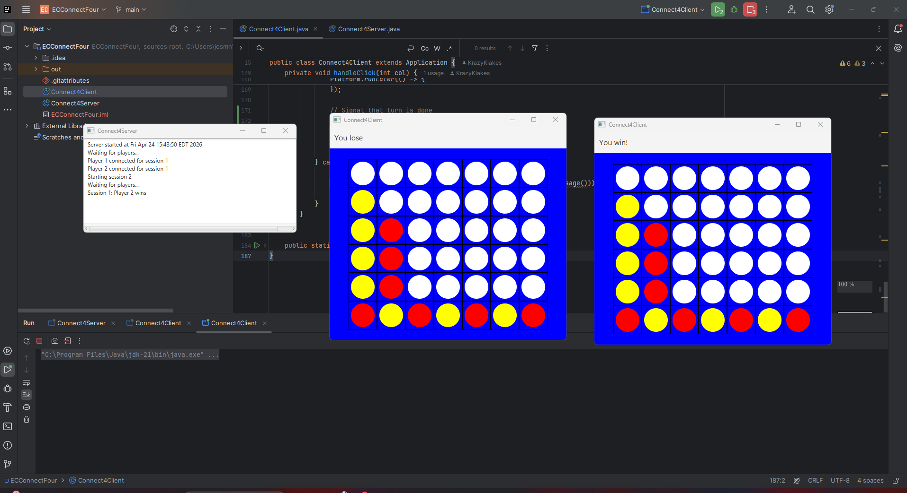
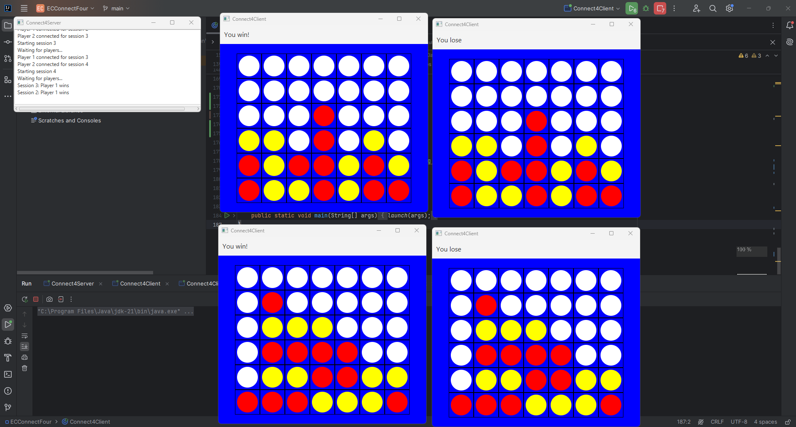
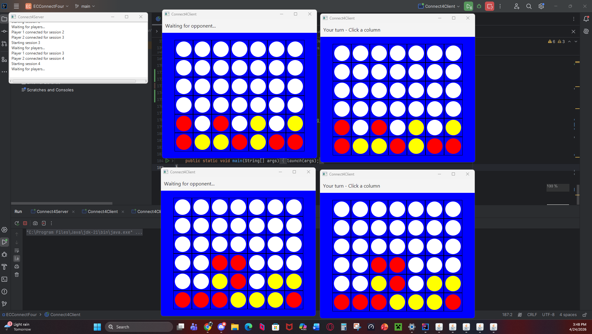

# Connect Four – Networked Multiplayer

A two-player networked Connect Four game built with Java and JavaFX. One player runs the server, and two clients connect to play against each other in real time. The server supports multiple simultaneous game sessions.

---

## Screenshots

### Win & Loss Detection


### Mirrored Boards – Multiplayer in Sync


### Two Different Games Happening at Once


---

## Requirements

- Java JDK 21
- JavaFX SDK 21 — download from https://openjfx.io

---

## Setup in IntelliJ IDEA

### 1. Add JavaFX as a Library
- Go to **File → Project Structure → Libraries**
- Click **+** → **Java**
- Navigate to your JavaFX SDK `lib` folder (e.g. `C:\javafx-sdk-21\lib`)
- Select all `.jar` files and click OK
- Click **Apply**

### 2. Configure Run Configurations
Go to **Run → Edit Configurations** and create two configurations:

**Run Server**
- Main class: `ECConnectFour.Connect4Server`
- VM options: `--module-path "path\to\javafx-sdk-21\lib" --add-modules javafx.controls,javafx.base,javafx.graphics`

**Run Client**
- Main class: `ECConnectFour.Connect4Client`
- VM options: `--module-path "path\to\javafx-sdk-21\lib" --add-modules javafx.controls,javafx.base,javafx.graphics`

---

## How to Run

1. Run the **Server** configuration — a server window will appear
2. Run the **Client** configuration **twice** — two game windows will open
3. Both clients will connect automatically and the game begins

---

## How to Play

- Player 1 is **Red**, Player 2 is **Yellow**
- Players take turns clicking a column to drop their piece
- First to connect four in a row (horizontally, vertically, or diagonally) wins
- The board is a 6×7 grid with gravity — pieces fall to the lowest open row

---

## Project Structure

```
ECConnectFour/
├── Connect4Server.java       # Server + game logic
├── Connect4Client.java       # Client GUI
├── screenshots/              # Demo screenshots
└── ECConnectFour.iml         # IntelliJ module file
```